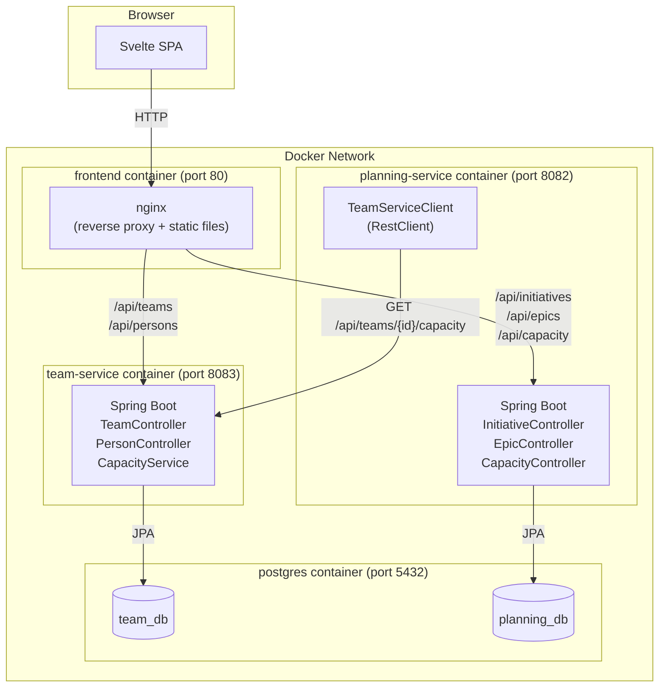
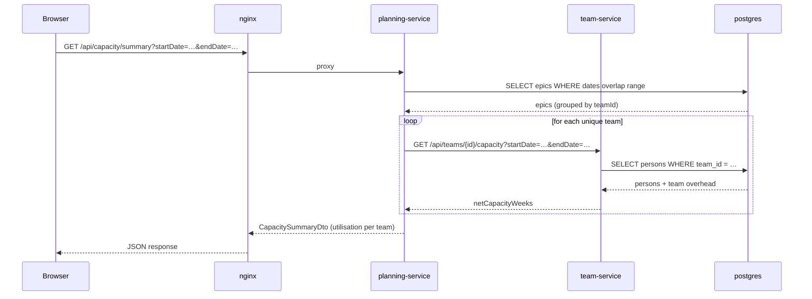

# Capacity Planning Tool — Design Document

## Overview

A web-based strategic capacity planning prototype for a mid-sized B2B software company (~150 engineers, ~15 teams). The tool replaces spreadsheet-based planning with a live, shared view of initiative roadmaps and team capacity.

**AI tooling used:** Claude Code (Anthropic) was used to scaffold the codebase — repos, services, controllers, Svelte routes, and Docker configuration. All architectural decisions and domain modelling were made by the author.

---

## Architecture

### System Diagram



### Request flow — capacity summary



### Microservice split

| Service | Responsibility | Port |
|---|---|---|
| `team-service` | Teams, persons, capacity calculation | 8083 |
| `planning-service` | Initiatives, epics, cross-team planning | 8082 |
| `frontend` | Svelte SPA served by nginx | 80 |
| `postgres` | Shared DB instance, two separate databases | 5432 |

### Technology choices

| Layer | Choice |
|---|---|
| Backend | Java 21 + Spring Boot 3.3 |
| ORM | Spring Data JPA + Hibernate |
| Database | PostgreSQL 16 |
| Frontend | Svelte 4 + Vite |
| Routing | svelte-spa-router |
| Gateway | nginx (embedded in frontend container) |
| Container | Docker + docker-compose |

---

## Data Model

### Team Service

```
Team
  id                 UUID (PK)
  name               VARCHAR NOT NULL
  description        TEXT
  overhead_percentage DECIMAL(5,2)   -- 0–100; accounts for meetings, support, on-call
  created_at         TIMESTAMP

Person
  id                    UUID (PK)
  team_id               UUID (FK → teams.id)
  name                  VARCHAR NOT NULL
  role                  VARCHAR
  availability_percentage DECIMAL(5,2)  -- 0–100; part-time, planned leave, etc.
  created_at            TIMESTAMP
```

### Planning Service

```
Initiative
  id           UUID (PK)
  name         VARCHAR NOT NULL
  description  TEXT
  status       ENUM (DRAFT, ACTIVE, COMPLETED, CANCELLED)
  priority     ENUM (LOW, MEDIUM, HIGH, CRITICAL)
  target_date  DATE
  created_at   TIMESTAMP

Epic
  id               UUID (PK)
  initiative_id    UUID (FK → initiatives.id)
  team_id          UUID              -- soft reference to team-service; no FK across services
  name             VARCHAR NOT NULL
  description      TEXT
  status           ENUM (PLANNED, IN_PROGRESS, COMPLETED, CANCELLED)
  estimated_weeks  DECIMAL(6,2)      -- developer effort in person-weeks
  start_date       DATE
  due_date         DATE
  created_at       TIMESTAMP
```

## Capacity Calculation

```
net_capacity_weeks = Σ(person.availability_pct / 100) × (1 − team.overhead_pct / 100) × working_weeks_in_period
```

Where:
- **availability_percentage** models individual-level FTE reduction (part-time contracts, planned parental leave, extended vacation)
- **overhead_percentage** models team-level overhead that cannot be avoided: recurring meetings, on-call rotations, support load, and unplanned interruptions
- **working_weeks_in_period** = count of Mon–Fri days ÷ 5, ignoring public holidays (assumption: public holidays are a minor correction; they can be added by subtracting them from the day count)

**Example:** A 4-person Backend team, each 100% available, 25% overhead, over a 13-week quarter:
```
net_capacity = 4.0 × (1 − 0.25) × 13 = 39 person-weeks
```

If epics allocate 36 person-weeks to that team in the same quarter → 92% utilisation → flagged as "at risk".

---

## Assumptions Made

| Area | Assumption | Rationale |
|---|---|---|
| Effort unit | `estimated_weeks` is person-weeks of developer time, not calendar weeks | Most meaningful unit for capacity comparison |
| Overhead | Team-level constant; does not vary by period | Simplification; in reality overhead varies by quarter (e.g. planning seasons). Could be made time-variant. |
| Person FTE | Person-level constant; does not vary by period | Simplification; in reality a person FTE varies by day (e.g. day off). Could be made time-variant. |
| Public holidays | Ignored in working-day count | Minor correction for prototype; parameterisable later |
| Epic allocation | Full `estimated_weeks` is charged to any period the epic overlaps | Conservative: doesn't prorate effort to the fraction of the period. A more accurate model would prorate by day overlap. |
| Team membership | Static snapshot; no historical tracking | Tracking headcount changes over time is a future extension |
| Authentication | None | Prototype; would add OAuth2/OIDC (e.g. Keycloak) for production |
| Multi-tenancy | Single tenant | B2B SaaS would need tenant isolation; deferred |

---

## Stakeholder Views

| Stakeholder | Primary view | Key metric |
|---|---|---|
| Higher Management | Dashboard — capacity overview across all teams | Teams at risk (>90% utilisation), critical initiatives |
| Eng Manager / PM | Initiative detail — epics per initiative, team assignments | Total estimated effort, delivery date risk |
| Team Lead / PO | Team detail — member availability, net capacity per quarter | Net capacity weeks vs. allocated weeks |

---

## API Summary

### team-service (port 8083)

| Method | Path | Description |
|---|---|---|
| GET | `/api/teams` | List all teams (with members) |
| POST | `/api/teams` | Create team |
| GET | `/api/teams/{id}` | Get team by ID |
| PUT | `/api/teams/{id}` | Update team |
| DELETE | `/api/teams/{id}` | Delete team |
| GET | `/api/teams/{id}/capacity?startDate=&endDate=` | Calculate net capacity for period |
| GET | `/api/persons/by-team/{teamId}` | List members of a team |
| POST | `/api/persons` | Add person to a team |
| PUT | `/api/persons/{id}` | Update person |
| DELETE | `/api/persons/{id}` | Remove person |

### planning-service (port 8082)

| Method | Path | Description |
|---|---|---|
| GET | `/api/initiatives` | List all initiatives (with epics) |
| POST | `/api/initiatives` | Create initiative |
| GET | `/api/initiatives/{id}` | Get initiative with epics |
| PUT | `/api/initiatives/{id}` | Update initiative |
| DELETE | `/api/initiatives/{id}` | Delete initiative |
| GET | `/api/epics` | List all epics |
| POST | `/api/epics` | Create epic |
| GET | `/api/epics/by-initiative/{id}` | Epics for a given initiative |
| PUT | `/api/epics/{id}` | Update epic |
| DELETE | `/api/epics/{id}` | Delete epic |
| GET | `/api/capacity/summary?startDate=&endDate=` | Cross-team capacity vs. allocation |
